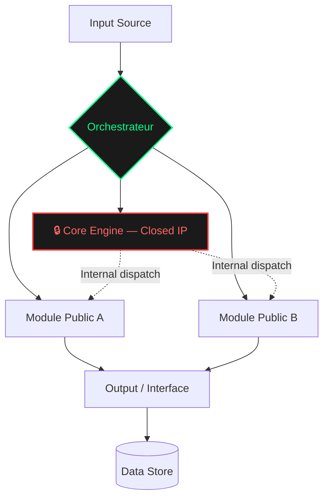

██████╗ ██████╗ ███████╗██╗███████╗████████╗███████╗██████╗  ██████╗ ███╗   ██╗ ██████╗███████╗██╗███╗   ██╗ ██████╗███████╗███████╗
██╔════╝██╔═══██╗██╔════╝██║██╔════╝╚══██╔══╝██╔════╝██╔══██╗██╔═══██╗████╗  ██║██╔════╝██╔════╝██║████╗  ██║██╔════╝██╔════╝██╔════╝
██║     ██║   ██║██████╗ ██║███████╗   ██║   ███████╗██████╔╝██║   ██║██╔██╗ ██║██║     █████╗  ██║██╔██╗ ██║██║     █████╗  ███████╗
██║     ██║   ██║██╔══╝  ██║╚══════╝   ██║   ╚══════╝██╔══██╗██║   ██║██║╚██╗██║██║     ██╔══╝  ██║██║╚██╗██║██║     ██╔══╝  ╚══════╝
╚██████╗╚██████╔╝██║     ██║███████╗   ██║   ███████╗██║  ██║╚██████╔╝██║ ╚████║╚██████╗██║     ██║██║ ╚████║╚██████╗███████╗███████╗
 ╚═════╝ ╚═════╝ ╚═╝     ╚═╝╚══════╝   ╚═╝   ╚══════╝╚═╝  ╚═╝ ╚═════╝ ╚═╝  ╚═══╝ ╚═════╝╚═╝     ╚═╝╚═╝  ╚═══╝ ╚═════╝╚══════╝╚══════╝
```

# [PROJECT_NAME]


---

## LE PROBLÈME & LA SOLUTION

### TL;DR

**Problème :** [Description chirurgicale du problème en 1-2 phrases.]

**Solution :** [Description de la solution déployée en 1-2 phrases.]

---

## MÉTRIQUES D'EXÉCUTION

| Métrique | Valeur |
|---|---|
| **Tokens totaux consommés** | [X] |
| **Temps conception → déploiement** | [X]h [X]min |
| **Nombre d'itérations** | [X] |
| **Cycles de debug** | [X] |
| **Infrastructure** | [Local / GPU / Cloud] |

---

## ARCHITECTURE DE HAUT NIVEAU

> ⚠️ *Ce diagramme illustre les flux et interfaces. La logique interne demeure Closed IP.*



**Légende :**
- 🟢 **Noeuds verts** — Interfaces publiques et flux observables
- 🔴 **Noeud rouge** — Moteur propriétaire (non distribué)
- **Lignes pleines** — Flux de données visibles
- **Lignes pointillées** — Dispatch interne (logique masquée)

---

## COMPOSANTS EXPOSÉS

| Composant | Rôle | Visibilité |
|---|---|---|
| `[Interface A]` | [Description] | `PUBLIC` |
| `[Interface B]` | [Description] | `PUBLIC` |
| `[Core Engine]` | [Description] | `CLOSED` |

---

## STACK TECHNIQUE

```
Runtime ............. [Node.js / Python / etc.]
LLM Backend ......... [Ollama / vLLM / etc.]
Infrastructure ...... [Quadro Rig / Local Server]
Proxy / Routing ..... [Nginx / Custom]
Monitoring ........... [Custom / Grafana / etc.]
```

---

## AVERTISSEMENT DE LICENCE

```
╔═══════════════════════════════════════════════════════════════════════╗
║                                                                       ║
║  ⚠️  CLOSED INTELLECTUAL PROPERTY                                    ║
║                                                                       ║
║  Ce dépôt est un PROOF OF WORK démontrant la capacité d'exécution    ║
║  de l'Architect. Le code source métier n'est pas distribué ici.      ║
║                                                                       ║
║  Toute reproduction, ingénierie inverse ou usage commercial          ║
║  du contenu potentiellement exposé est strictement interdit           ║
║  sans accord explicite et écrit.                                      ║
║                                                                       ║
║  → Consultez LICENSE_RESTRICTIVE.md pour les termes complets.         ║
║                                                                       ║
╚═══════════════════════════════════════════════════════════════════════╝
```

---

<div align="center">

*Architected by [The Architect](https://github.com/cotcollective) · Montréal, QC*

</div>